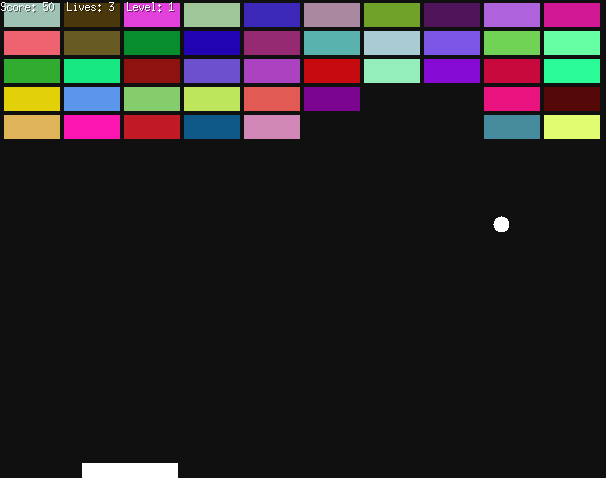

# Go Breakout Game

A simple clone of the classic **Breakout** arcade game written in Golang using the [Ebiten](https://ebiten.org) 2D game library.



## Game Features

- Brick-breaking action across multiple levels
- Randomized colorful brick patterns
- Score tracking and life system
- Gradually increasing difficulty:
  - Faster ball speed per level
  - Smaller paddle every other level (down to a minimum size)
- "Game Over" and "You Win" screens
- Simple, fast, and portable

---

## Controls

| Key        | Action            |
|------------|-------------------|
| Left Arrow     | Move paddle left  |
| Right Arrow    | Move paddle right |
| Spacebar   | Restart or advance level |

---

## How to Run Locally

### Prerequisites

#### Go (1.20 or later recommended)

Download from: https://golang.org/dl/

Verify:

```bash
go version
```

#### Required X11 Dependencies for Linux

If you're on Fedora, install:

```bash
sudo dnf install libX11-devel libXrandr-devel libXcursor-devel \
  libXinerama-devel libXi-devel mesa-libGL-devel libXxf86vm-devel
```

On Debian/Ubuntu:

```bash
sudo apt install libx11-dev libxrandr-dev libxcursor-dev \
  libxinerama-dev libxi-dev libgl1-mesa-dev libxxf86vm-dev
```

These are required by GLFW (used internally by Ebiten) for rendering under X11, even if you're using Wayland.

### Clone the Repo

```bash
git clone https://github.com/gcagle3/go-breakout.git

cd go-breakout
```

### Run the Game

To run the game directly: 

```bash
go run main.go
```

Alternatively, you can use the following to build a go binary:

```bash
go build -o breakout
./breakout
```


